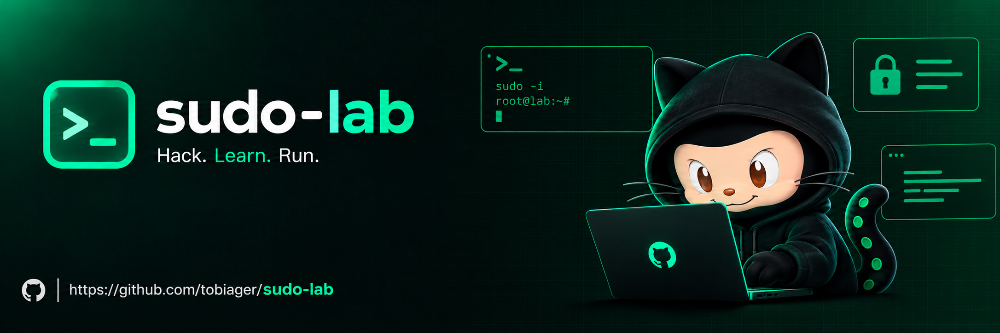

<div align="center">



<h1 align="center">sudo-lab</h1>

**Laboratorio reproducible de diagnóstico y mitigación de vulnerabilidades de `sudo`.**

[](https://github.com/USUARIO/sudo-lab/actions/workflows/ci.yml)

</div>

Anexo práctico del trabajo de investigación *"Vulnerabilidades en sudo: escalada de
privilegios local, explotación en laboratorio y mitigación"* (UNNE – FaCENA).

## Qué es

Un contenedor Docker **intencionalmente vulnerable** (Debian 12, `sudo 1.9.15` compilado
desde fuente) más tres instrumentos defensivos que corren dentro de él:

- **`scan.sh` — Diagnóstico de exposición (①):** determina, CVE por CVE, si el sistema es
  explotable combinando versión + precondiciones reales. No explota nada.
- **`mitigate.sh` — Mitigación (③):** aplica controles compensatorios sin parchear
  (hardening de sudoers + `/tmp noexec`) y verifica con re-scan; `--reset` restaura el
  estado vulnerable.
- **`benchmark.sh` — Medición (④, opcional):** mide tasa de éxito y tiempo de escalada de
  un PoC externo provisto por el operador, antes y después de mitigar.

El acceso inicial se **simula** con el usuario `webuser` (`foothold.sh`, ②): no hay
servicio web ni payload de RCE — la cadena se narra en
[`docs/ATTACK-CHAIN.md`](docs/ATTACK-CHAIN.md). Un dashboard (Next.js 15, solo
`localhost:3000`) orquesta todo vía `docker exec`.

**Alcance:** 2 CVEs foco (CVE-2025-32463 chroot/NSS, CVE-2025-32462 opción host) y 3
CVEs históricas como contexto (2023-22809, 2021-3156, 2019-14287). Definiciones
operativas y glosario de estados: [`docs/SCOPE.md`](docs/SCOPE.md) (normativo).

**PoC externos (Opción B):** el repositorio versionado **no distribuye exploits**
(política en [`SECURITY.md`](SECURITY.md) §3). El operador coloca `poc_32463.sh` y
`poc_32462.sh` en `./poc/` (en el paquete de entrega viajan como `poc/*.txt`); sin PoC,
el benchmark reporta `POC_NO_DISPONIBLE` y el modo diagnóstico + mitigación es igualmente
funcional.

## Requisitos

- Docker + Docker Compose v2 (puede verificarse con `make preflight`)
- Node.js 22 LTS (solo para el dashboard; versión fijada en `dashboard/.nvmrc`)

## Puesta en marcha

```bash
docker compose up -d --build --wait    # o: make up   (compila sudo y espera healthy)

cd dashboard && npm install && npm run dev    # http://localhost:3000
```

Flujo sugerido en el panel: **① Diagnosticar** → **② Simular foothold** →
**③ Aplicar mitigaciones + re-escanear** (los hallazgos pasan de `EXPLOTABLE` a
`MITIGADO`) → comparar → **↺ Restaurar** para repetir la demo. El botón **④ Lanzar
ataque** se habilita solo con PoC presente en `./poc/`.

Por consola, los mismos comandos son `make scan | foothold | mitigate | reset | benchmark`
(`make help` lista todo). En Windows (Docker Desktop) no se necesita `make`: tabla de
equivalencias en [`docs/REPRODUCIBILITY.md`](docs/REPRODUCIBILITY.md) §3.1.

Para **reproducir las tablas de resultados** completas (protocolo de medición pre/post,
pasos A–G): [`docs/REPRODUCIBILITY.md`](docs/REPRODUCIBILITY.md). Problemas frecuentes:
§6 de ese mismo documento.

## Documentación

| Documento | Contenido |
|---|---|
| [`docs/SCOPE.md`](docs/SCOPE.md) | Alcance, glosario de estados y criterio de "mitigado" (**normativo**) |
| [`docs/THREAT-MODEL.md`](docs/THREAT-MODEL.md) | Activos, adversarios y fronteras de confianza |
| [`docs/ARCHITECTURE.md`](docs/ARCHITECTURE.md) | Componentes, flujos de datos y decisiones de diseño |
| [`docs/SECURITY.md`](docs/SECURITY.md) | Capabilities del contenedor (§2.2), riesgos del lab y política del PoC (§3) |
| [`docs/ATTACK-CHAIN.md`](docs/ATTACK-CHAIN.md) | Cadena de ataque representada y mapeo MITRE ATT&CK |
| [`docs/METRICS.md`](docs/METRICS.md) | Contrato de métricas: definiciones, fórmulas y formato TSV |
| [`docs/METHODOLOGY.md`](docs/METHODOLOGY.md) | Protocolo de medición (cómo se producen los datos) |
| [`docs/RESULTS.md`](docs/RESULTS.md) | **Resultados empíricos** (fuente única de cifras y tablas) |
| [`docs/REPRODUCIBILITY.md`](docs/REPRODUCIBILITY.md) | Pasos exactos para replicar cada tabla + troubleshooting |
| [`docs/LIMITATIONS.md`](docs/LIMITATIONS.md) | Limitaciones con ID citable (L-1…L-16) para el paper |
| [`docs/POC.md`](docs/POC.md) | Fuentes, adaptación y convención `.user` de los PoC externos |
| [`docs/PAPER-OUTLINE.md`](docs/PAPER-OUTLINE.md) | Esqueleto-guía del paper JAIIO (material interno) |
| [`SECURITY.md`](SECURITY.md) | Reglas breves de uso seguro del laboratorio |

## Estructura del repositorio

```
sudo-lab/
├── docker-compose.yml        # orquestación del target (cap_drop ALL + 7 capabilities)
├── Makefile                  # interfaz única de comandos (up/scan/mitigate/…)
├── lab/                      # Dockerfile (sudo vulnerable + HEALTHCHECK), entrypoint, sudoers
├── scripts/                  # scan · mitigate · foothold · benchmark · preflight (montados :ro)
├── dashboard/                # Next.js 15: UI + API routes (docker exec)
│   └── lib/lab.ts            # runner + parser del TSV
├── poc/                      # PoC externos (sin versionar; en la entrega: poc_*.txt)
└── docs/                     # documentación académica (índice arriba)
```

## Uso responsable

Proyecto **educativo y defensivo**: se ejecuta en máquina local, dentro de los contenedores de
este repo, sin exponer puertos ni atacar sistemas de terceros. Reglas completas en
[`SECURITY.md`](SECURITY.md). La mitigación completa de las CVEs de 2025 es actualizar a
`sudo 1.9.17p1` o posterior; los controles del lab son compensatorios para escenarios
legacy.
